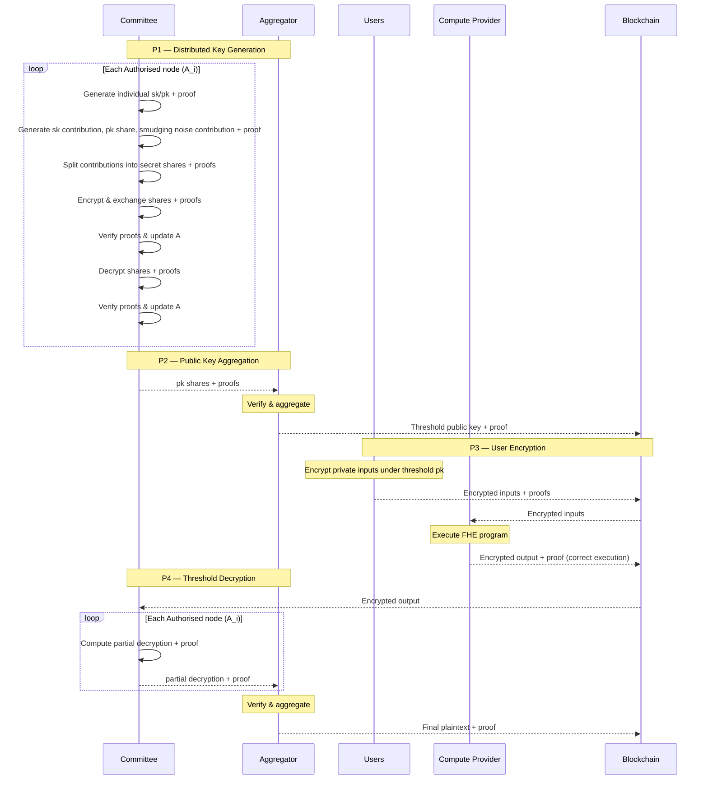
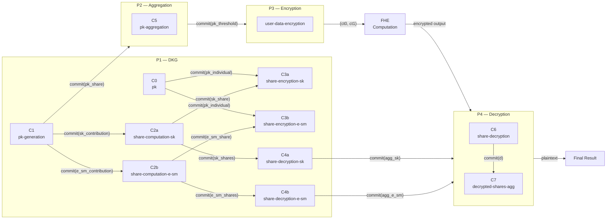

> This is a mirror of the article I wrote for [The Interfold](https://www.theinterfold.com/) blog — [Cryptographic Series](https://blog.theinterfold.com/verifiability-in-the-coordination-trilemma/).
> Special thanks to The Interfold cryptographers ([Zahra](https://www.linkedin.com/in/zahra-javar-066072b3/), [Younes](https://www.linkedin.com/in/younes-talibi-alaoui-a1b300145)) and engineers / comms ([Omar](https://cedoor.dev/), [Ale](https://x.com/ctrlc03), [Marv](https://x.com/eccogrinder)) for feedback and review.

## Motivation

A well-understood problem in cryptography is proving that a computation was performed correctly without revealing the underlying secrets. Zero-knowledge proofs (ZKPs) solve this by allowing anyone to verify that a statement is true without learning anything beyond the statement's validity. The mathematics provides all the necessary guarantees; trust in the prover is unnecessary.

However, what happens when we shift from a single prover to many provers in an adversarial setting? When a group jointly executes a protocol (e.g., generating a shared key), they must ensure that each step is correct and that no participant can compromise the result unilaterally. Existing approaches address this by distributing trust across a threshold of parties; the protocol succeeds if enough of them behave correctly. The main concern is that this passive trust is _fragile_. What if the protocol instead required verifiability without breaking the constraints on aggregation and confidentiality among the parties? This is the challenge that the following design addresses: the **Coordination Trilemma**. The goal is to enable multiple parties to coordinate without exposing their secrets, avoid centralisation of power, and maintain the public verifiability of every step of their cryptographic computations.

To illustrate the complexity, consider a group of hospitals aggregating sensitive patient data for epidemic prediction. In order to predict and rapidly respond to emergent epidemics, the hospitals would like to know the aggregate number of patients treated for a variety of common contagions each week. However, due to privacy regulations, the hospitals cannot divulge their individual numbers to one another. Each hospital must contribute its sensitive data, prove that its contribution was formed correctly, and verify that every other participant followed the protocol.

From a cryptographic perspective, satisfying these constraints requires that the protocol ensure:

- No single party ever controls the secret key.
- Key generation and distribution are publicly verifiable.
- Individual secrets remain hidden throughout.
- Malicious participants can be detected and excluded automatically.
- Anyone, including external observers, can verify the protocol's correctness without learning any secret.

Solving these issues is not a matter of better engineering or stricter policy; it requires a fundamentally different cryptographic architecture.

## Zero-Knowledge Verifiability

The following is a design of a cryptographic construction that combines threshold fully homomorphic encryption (FHE) with distributed key generation (DKG), using zero-knowledge proofs (ZKPs) at every stage to ensure that each step — from key generation to final decryption — is publicly verifiable. We developed this system to bridge the gap between theory and practical confidential computing, replacing trust assumptions with verifiable, programmable cryptography backed by economic incentives.

Generally, for each collaborative computation, an FHE program runs inside an [Encrypted Execution Environment](https://blog.theinterfold.com/an-introduction-to-encrypted-execution-environments/) ([E3](https://blog.theinterfold.com/an-introduction-to-encrypted-execution-environments/)). After a request for confidential computation, a committee of ${N}$ [ciphernodes](https://blog.theinterfold.com/ciphernodes/) is selected through a verifiable random _sortition_ process. At this stage, rather than relying on a single trusted dealer, each ciphernode independently generates its own secret key contribution and uses the _Public Verifiable Distributed Key Generation_ (**PVDKG**) protocol to share it with all other parties.

The protocol ensures that the key generation process is correct and that malicious parties can be identified and excluded in subsequent steps without any party learning the secrets. We refer to the set of parties allowed to participate in an E3 as the set of _authorised ciphernodes_ (${A}$). This set, at the beginning, contains all ${N}$ ciphernodes and is updated whenever a malicious node is identified. The resulting threshold public key is then posted on the blockchain as a verifiable reference that users rely on to encrypt their private inputs (note that the threshold $T >= (N − 1)/2$ of nodes is configurable at the program level). Once the input submission window closes, the E3 runs the FHE computation over the encrypted inputs according to the program's logic (e.g., a private vote tally, as in [CRISP](https://blog.theinterfold.com/crisp-private-voting-secret-ballot-fhe-zkp-mpc/)), which returns a proof of correct execution (due to FHE execution inside a zkVM) along with the encrypted output. Finally, a threshold of $T+1$ honest authorised ciphernodes from the committee coordinate to decrypt the output through partial decryptions that, when aggregated, yield the final decrypted result.

Thanks to zero-knowledge circuits, every step of this process can be verified independently by anyone without running the computation once again. In fact, each phase produces a cryptographic proof that anyone can check, shifting trust from the process itself to the underlying mathematics. In addition to the cryptographic verifiability guarantees, the Interfold design also includes an economic security layer. Ciphernodes that behave dishonestly (deviate from the protocol) are penalised through _slashing_. Mathematics makes cheating detectable, while economics makes it irrational.

## ZK Circuits Design

Before delving into the details of the zero-knowledge circuits, it is worth clarifying some notation and design choices.

### Notation

During the Threshold FHE distributed key generation, each ciphernode produces a secret key contribution that will be aggregated to form the threshold key. To distribute these contributions securely, each ciphernode splits its contribution into _secret shares_ and sends one share to every other authorised ciphernode in ${A}$. Since shares must remain confidential, they cannot be sent in plaintext. Therefore, each ciphernode generates its own individual FHE key pair, and these shares are encrypted under the recipient's individual public key before being published. Concretely, when node $i$ wants to send a share to node $j$, it encrypts the share using node $j$'s individual public key; node $j$ then recovers the share using its corresponding individual secret key. Note that the encryption scheme used for these individual keys is also BFV — the same scheme used for the threshold FHE key itself (i.e., the threshold key is specifically a BFV key). To avoid confusion, we adopt the following terminology throughout this article:

- **Individual key pair**: the BFV key pair that each ciphernode holds independently, used to encrypt and decrypt data exchanged between nodes during the PVDKG protocol (as defined above).
- **Secret key contribution**: a single ciphernode's contribution to the secret key corresponding to the threshold public key.
- **Public key share** (also referred to as _public key contribution_): the BFV public key corresponding to a secret key contribution.
- **Secret key share**: a ciphernode's _Shamir_ share of the secret key corresponding to the threshold public key.
- **Threshold public key**: the BFV public key that the ciphernodes jointly generate. The corresponding secret key is never held by any single party; instead, it is secret-shared across the ${A}$ ciphernodes.
- **Partial decryption** (also referred to as _decryption share_): a ciphernode's _Shamir_ share over a decrypted value, computed before the rounding step.
- **Secret share**: a _Shamir_ secret share of some value.

Additionally, during decryption the ciphernodes use a variant that introduces _smudging noise_ ($e_{sm}$) to prevent information leakage. This smudging noise is generated collectively via MPC prior to the decryption phase. Following the same naming convention, we define **smudging noise contribution** (a single ciphernode's contribution to the smudging noise) and **smudging noise share** (a ciphernode's _Shamir_ share of the smudging noise).

### Phases

First, when architecture is deployed, a ZKP is created to verify that all cryptographic parameters and configurations were generated correctly and consistently shared across all ciphernodes. Then, for each program request and execution, we can break the workflow into four sequential phases:

- **P1 — Distributed Key Generation**: Each ciphernode generates its secret key contribution along with the corresponding public key share. The secret key contribution is then split into _Shamir_ secret shares, encrypted under the receiver's individual public key, and distributed to the other committee nodes. The same process is applied to the smudging noise contributions. Several circuits verify the entire chain of cryptographic operations — from generation to share computation, encryption, and decryption. Throughout this phase, the set ${A}$ of authorised ciphernodes is updated, leaving only the honest nodes.
- **P2 — Public Key Aggregation**: The public key shares from parties in ${A}$ are aggregated to form the threshold public key. A dedicated circuit verifies that this aggregation was computed correctly by a node acting as the aggregator.
- **P3 — User Encryption**: Users encrypt their private inputs using the threshold public key. This phase uses a specialisation of the [GRECO](https://blog.theinterfold.com/enclave-cryptography-greco-fhe-zk/) circuit, which proves that each encryption is formed correctly without revealing the plaintext or the encryption randomness.
- **P4 — Threshold Decryption**: After the homomorphic computation, the ciphernodes in ${A}$ collaborate to decrypt the final output by computing partial decryptions of the result. The circuits verify both the individual decryption shares and the final aggregated result, ensuring correctness without reconstructing the full secret key.

The following diagram illustrates the sequence and connections among the ciphernodes cryptographic operations and zero-knowledge circuits.

One thing worth noticing is that the circuits across phases are not isolated — they are linked together through cryptographic commitments. FHE keys and, more generally, polynomials under post-quantum secure parameters for the BFV scheme are large objects, far too costly to publish on-chain. Instead, each circuit commits to its outputs using [SAFE](https://hackmd.io/@7dpNYqjKQGeYC7wMlPxHtQ/ByIbpfX9c), an efficient hashing framework built on top of [Keccak256](https://keccak.team/keccak.html) and [Poseidon2](https://eprint.iacr.org/2023/323). Downstream circuits then take the expected commitment as a public input and the underlying values as private inputs, recompute the commitment inside the circuit, and verify that it matches. This is how, for example, _C1_ (key generation) connects to _C5_ (public key aggregation): _C5_ verifies the commitment produced by _C1_ without the raw polynomials ever appearing on-chain — only the compact commitment needs to be published, since on-chain verification operates solely over the circuit's public inputs. The following diagram represents the _chain of accountability_: ciphernodes cannot substitute different values between phases, and consistency is guaranteed throughout the entire protocol thanks to cryptographic commitments.

### P1 **— Distributed Key Generation**

#### Generation

Before any sharing can take place, each ciphernode must establish two things: an individual key pair for secure data exchange with other nodes and its contributions to the threshold key and smudging noise.

The individual key pair is handled by _C0_. This circuit takes the individual public key components ( $pk_0$ and $pk_1$, polynomial arrays over $L$ CRT moduli) and produces a cryptographic commitment. When a ciphernode later encrypts a share for another party, the encryption circuit (_C3_) will verify that the public key used matches the commitment returned by _C0_ — ensuring that node $i$ actually encrypted under node $j$'s key.

With individual keys committed, each ciphernode then generates its secret key contribution, the corresponding public key share, and its smudging noise contribution. Circuit _C1_ proves that the public key share was derived correctly from the secret key contribution using the BFV key generation equations:

$$
pk_0 = -a \cdot sk + e + r_2 \cdot (X^N + 1) + r_1 \cdot q_i
$$

$$
pk_1 = a
$$

The circuit takes the common reference string polynomial ($a$) as public input. The public key components ($pk_0,pk_1$), secret key ($sk$), error polynomial ($e$), smudging noise ($e_{sm}$), and quotient polynomials ($r_1,r_2$) from the modular reduction operations form the secret _witness_. Verification begins by performing range checks on all witness values to ensure they stay within the bounds required for BFV correctness and the security of the GRECO proving. Then the key generation equation at a single random challenge point $\gamma$ derived via [Fiat-Shamir](https://en.wikipedia.org/wiki/Fiat%E2%80%93Shamir_heuristic) is verified. This applies the [Schwartz-Zippel Lemma](https://en.wikipedia.org/wiki/Schwartz%E2%80%93Zippel_lemma): if the polynomial equation holds at a randomly chosen point, it holds for all coefficients with overwhelming probability — avoiding the cost of checking every coefficient individually. A detailed explanation of this technique can be found in our previous [blog post](https://blog.theinterfold.com/enclave-cryptography-greco-fhe-zk/) covering GRECO. _C1_ outputs three commitments that feed downstream circuits:

- $commit(sk_{contribution})$: consumed by _C2a_ for secret key contribution share computation,
- $commit(e_{{sm}_{contribution}})$: consumed by _C2b_ for smudging noise contribution share computation,
- $commit(pk_{share})$: consumed by _C5_ in P2 for public key aggregation.

Both _C0_ and _C1_ run once per ciphernode in ${A}$ (at this point, ${A}$ contains all ${N}$ ciphernodes). At the end of this stage, every ciphernode has publicly committed to its individual key and its threshold key and smudging noise contributions without leaking any secret. The next step is distributing those contributions securely.

#### Share Distribution

Each ciphernode now holds its verified contributions but needs to distribute them to the rest of the committee without revealing the underlying secrets. This happens in two steps: first the contributions are split into shares (_C2_); then each share is encrypted under the recipient's individual public key and transmitted (_C3_).

**Splitting into shares.** Each ciphernode splits its secret key contribution (_C2a_) and smudging noise contribution (_C2b_) into shares using [Shamir's Secret Sharing](https://en.wikipedia.org/wiki/Shamir%27s_secret_sharing). The shares are organised in a three-dimensional matrix indexed by polynomial coefficient, CRT modulus, and party:

$$
y[i][j][k] \quad \text{where} \quad y[i][j][0] = \text{secret}, \quad y[i][j][k \geq 1] = \text{share for party } k
$$

The first entry holds the original secret ($sk$ for _C2a_ and $e_{sm}$ for _C2b_), and the remaining entries hold the shares distributed to each party. The circuit verifies two properties:

- **Consistency with C1**: $y[i][j][0]$ matches the secret committed in _C1_, confirming the shares were built from the correct secret.
- **Valid secret sharing**: the shares form a valid [Reed-Solomon codeword](https://en.wikipedia.org/wiki/Reed%E2%80%93Solomon_error_correction). A parity check matrix ${H}$ is constructed such that valid shares must satisfy:

$$
H_j \cdot y_{i,j}^T = 0\;\bmod\;q_j
$$

This guarantees consistency with a polynomial of degree at most ${T}$ — without ever reconstructing the polynomial itself. Range checks additionally verify that all share values stay within the valid bounds for their respective CRT moduli, preventing maliciously large values from breaking reconstruction. The circuit outputs a commitment for each party's share, binding the share values for the next step. Each variant (_C2a_ and _C2b_) runs once per ciphernode in ${A}$.

**Encrypting for transmission.** With shares committed, each ciphernode must encrypt them so they can be securely transmitted. _C3a_ handles shares of the secret key contribution and _C3b_ handles shares of the smudging noise contribution. The circuit verifies two commitment links simultaneously: the plaintext being encrypted matches the share commitment from _C2_, and the recipient's individual public key matches the commitment from _C0_. Together these checks guarantee that the correct share is encrypted under the correct recipient's key — without exposing the share in plaintext.

The secret witness includes the random ternary polynomial ($u$), error polynomials ($e_0,e_1$), the raw share ($m$), and quotient polynomials ($r_1,r_2$ and $p_1,p_2$) from modular reduction and the public key components ($pk_0,pk_1$). The resulting ciphertext components ($ct_0,ct_1$) and commitments ($commit_{pk}$ and $commit_m$) form the public inputs. After range checks on all witness values and CRT consistency verification for $e_0$ against $e_{{0}_{is}}$ and $e_{{0}_{quotients}}$, the circuit computes the scaled message ($k_{1}$) from the raw share to embed the plaintext into ciphertext space, using the per-modulus scaling factors $k_{{0},{is}} = (-t)^{-1} \mod q_i$, then verifies that the BFV encryption equations hold at a random Fiat-Shamir challenge point via the Schwartz-Zippel Lemma — the same technique used in _C1_, applied here to the encryption equations:

$$
ct_0 = pk_0 \cdot u + e_0 + k_1 \cdot k_0 + r_1 \cdot q + r_2 \cdot (X^N + 1)
$$

$$
ct_1 = pk_1 \cdot u + e_1 + p_1 \cdot q + p_2 \cdot (X^N + 1)
$$

Unlike previous circuits, _C3_ produces no new commitments — its role is purely to verify correct encryption. It also has the highest proof count in the protocol: each of the ${A}$ ciphernodes encrypts shares for every other, resulting in $|A| \times (|A| - 1)$ proof instances per variant (_C3a_ and _C3b_). The resulting ciphertexts ($ct_0,ct_1$) are broadcast to the intended recipients, who will decrypt and verify them in the next (final) DKG step.

#### Shares Decryption

Each ciphernode has now received encrypted shares from every other party and decrypts them using its own individual BFV secret key. But correct decryption cannot simply be assumed — a malicious node could decrypt correctly and then claim a different value or use the wrong key entirely.

_C4_ addresses this by verifying that each decrypted value matches the corresponding share commitment from _C2_ (_C2a_ for secret key shares, _C2b_ for smudging noise shares). Since the commitments are binding, producing a different share with the same commitment is computationally infeasible (assuming collision resistance of the hash function).

Beyond verification, the circuit performs a critical aggregation step. Rather than simply storing the individual shares, it sums all verified shares received from other ciphernodes, coefficient-wise, for each CRT modulus:

$$
agg[l][i] = \sum_{a \in A} share[a][l][i] \bmod q_l
$$

This reflects the threshold key construction directly. The secret key corresponding to the threshold public key equals the sum of all secret key contributions ($sk = \sum_{i \in A} sk_i$), so after aggregation each ciphernode holds a Shamir share of this sum — its _secret key share_. This is what will be used for threshold decryption in P4 (note that the same logic applies to the smudging noise). The circuit commits to these aggregated values: for _C4a $commit(sk_{agg})$_ and $commit(e_{{sm}_{agg}})$ for _C4b_. These two commitments form the final link between P1 and P4 — when a ciphernode later computes its partial decryption in _C6_, the circuit will verify that the secret key share and smudging noise share used match exactly what was aggregated here. Each variant (_C4a_ and _C4b_) runs once per ciphernode in ${A}$.

At the end of P1, every honest ciphernode holds a verified share of the threshold secret key and the smudging noise, with all contributions traceable back through the commitment chain to their origin in _C1_. Any party whose proofs failed at any step has been excluded from ${A}$, and only authorised ciphernodes proceed to the next phases.

### P2 **— Public Key Aggregation**

With every ciphernode's public key share committed and verified in P1, a single node acting as the aggregator now combines them into the threshold public key. Circuit _C5_ verifies that this aggregation was computed correctly by summing the contributions from the authorised parties ${A}$. The corresponding proof is posted on-chain.

The aggregation itself is straightforward addition. For each CRT modulus $l$ and each polynomial coefficient $i$, the circuit checks:

$$
pk_{{0}_{agg}}[l][i] = \sum_{a \in A} pk_0[a][l][i] \bmod q_l
$$

$$
pk_{{1}_{agg}}[l][i] = \sum_{a \in A} pk_1[a][l][i] \bmod q_l
$$

Before performing the aggregation, the circuit confirms that each public key share matches its commitment from _C1_ — ensuring no party has substituted a different value since key generation. This simple addition works since the threshold public key is the sum of the public key shares and the corresponding threshold secret key equals the sum of the secret key contributions. This is exactly the secret that each ciphernode holds a share of after P1. The circuit outputs $commit(pk_{threshold})$, which is posted on-chain as the encryption key commitment for users who will verify it before encrypting their private inputs in P3. This circuit runs once, executed by the aggregator after all P1 proofs have been collected and the authorised parties set ${A}$ has been finalised.

### P3 — User Encryption

With the threshold public key published and its commitment verified on-chain, users can now encrypt their private inputs. This phase uses a specialization of the [GRECO](https://blog.theinterfold.com/enclave-cryptography-greco-fhe-zk/) circuit, which proves that each ciphertext was formed correctly under the threshold public key without revealing the plaintext or the encryption randomness. The circuit verifies the commitment $commit(pk_{threshold})$ from _C5_ before validating the encryption, ensuring users encrypt under the correct verified key.

The resulting ciphertexts are collected and passed to the FHE program, which performs the homomorphic computation directly on encrypted data inside a zkVM. Only the encrypted output of that computation, along with a proof of correct execution, is published on-chain. The authorised ciphernodes then proceed to threshold decryption in P4.

### P4 — Threshold Decryption

After the homomorphic computation is complete (such as a tally of encrypted votes in [CRISP](https://blog.theinterfold.com/crisp-private-voting-secret-ballot-fhe-zkp-mpc/)), the result is an encrypted output that no single party can decrypt alone. Each authorised ciphernode independently computes a _decryption share_ from its secret key share and smudging noise share (both produced and verified in P1) and sends it to the aggregator along with a zero-knowledge proof of correctness. Once $T+1$ valid shares are collected, _Lagrange Interpolation_ combines them to recover the plaintext — without ever reconstructing the full secret key.

The requirement for $T+1$ shares follows directly from the properties of Shamir's scheme: to determine a degree-$T$ polynomial (and hence the secret held as its constant coefficient), at least $T+1$ evaluation points are needed.

#### Decryption Shares

Each ciphernode computes its decryption share $d$ from the encrypted output ($ct_0, ct_1$) using:

$$
d[l] = ct_0[l] + ct_1[l] \cdot sk[l] + e_{sm}[l] + r_2[l] \cdot (X^N + 1) + r_1[l] \cdot q[l]
$$

where $sk$ is the ciphernode's secret key share (from _C4a_), $e_{sm}$ is its smudging noise share (from _C4b_), and $r_1,r_2$ are quotient polynomials for modular reduction. The circuit first verifies that $sk$ and $e_{sm}$ match their commitments from _C4a_ and _C4b_, ensuring no substitution is possible at decryption time. Range checks on these values are not repeated — P1 already performed them, and commitment binding guarantees they are unchanged. The decryption equation is then verified using the Schwartz-Zippel Lemma at a Fiat-Shamir challenge point, following the same pattern as _C1_ and _C3_.

The decryption share $d$ reveals nothing about $sk$, thanks to the smudging noise introduced during the computation. The circuit commits to the decryption share ($commit(d)$), which is passed to _C7_ for aggregation. This circuit runs at least $T+1$ times — once for each ciphernode contributing a valid decryption share.

#### Final Decryption

With $T+1$ valid decryption shares collected, the aggregator combines them to recover the final plaintext. Circuit _C7_ verifies this process in three steps. The corresponding proof is posted on-chain.

**Lagrange coefficients.** For each CRT modulus $l$, the circuit computes the Lagrange coefficients ($L_i(0)$) in-circuit, preventing any party from manipulating them:

$$
L_i(0) = \prod_{j \neq i} \frac{-x_j}{x_i - x_j} \bmod q_l
$$

where $x_1, \ldots, x_{T+1}$ are the identifiers of the authorised parties, processed in ascending order.

**Interpolation and CRT reconstruction.** The interpolated value for each CRT modulus is:

$$
u^{(l)} = \sum_i d_i^{(l)} \cdot L_i(0) \bmod q_l
$$

The circuit then verifies CRT reconstruction, lifting the per-modulus ($l$) values to a single global value $u_{global}$:

$$
u^{(l)} + r^{(l)} \cdot q_l = u_{global} \quad
$$

where $r^{(l)}$ are quotient polynomials provided as secret witnesses.

**Decoding.** The final message is decoded from $u_{global}$ using:

$$
message = -Q^{-1} \cdot (t \cdot u_{global})_Q \bmod t
$$

where $Q$ is the product of all CRT moduli and $t$ is the plaintext modulus. The decoding handles centered representation: if $(t \cdot u_{global}) \bmod Q \geq Q/2$, the value is treated as negative, ensuring coefficients are correctly recovered within $[0, t)$.

The output is the final plaintext — the result of the encrypted computation, publicly verifiable by anyone. This circuit runs once, executed by the aggregator after $T+1$ valid _C6_ proofs have been collected.

## Conclusions

Zero-knowledge proofs shift trust from parties to mathematics. This enables large-scale collaborative confidential computing: a chain of cryptographic commitments and verifications across every circuit ensures that:

- **Correctness**: every secret share, encryption, and decryption is verified through zero-knowledge proofs — from key generation in _C1_ through to the final plaintext in _C7_.
- **Binding**: commitments link values across circuits via SAFE, preventing parties from substituting different values between steps. The chain of accountability spans the entire protocol.
- **Privacy**: no party ever sees another party's secret key, shares, or contributions in plaintext. Smudging noise ensures that decryption shares reveal nothing about the underlying secrets.
- **Public verifiability**: anyone, including external observers with no role in the computation, can independently verify every proof without re-running the computation.
- **Active security**: malicious parties are automatically detected and excluded when their proofs fail. The authorised set $A$ is updated throughout P1, ensuring that only honest ciphernodes contribute to the final threshold key.

Users can encrypt data knowing that no single ciphernode (or even a minority coalition) can decrypt it alone. Decryption requires an honest majority to collaborate, and every step of that collaboration is verifiably correct. After decryption, the threshold FHE key becomes cryptographic _toxic waste_ and is never reused, ensuring that each computation is an isolated, self-contained trust boundary.

Through this design, we achieve trustless threshold cryptography without relying on trusted parties or dealers. Secrets can be distributed, computed on, and reconstructed while remaining verifiably secure throughout.
