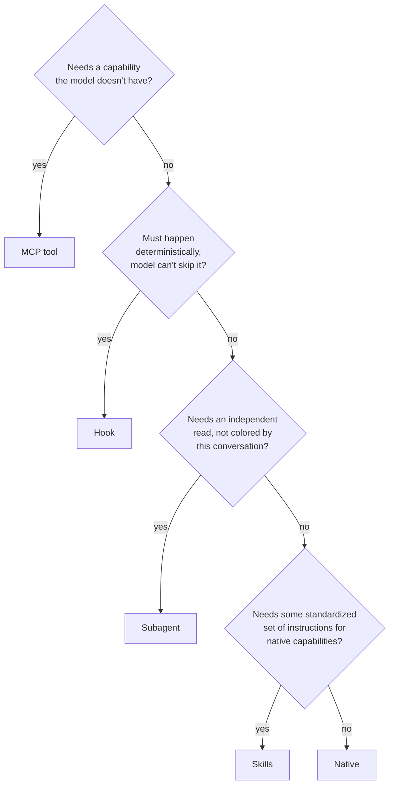

In my [previous post](https://0xjei.dev/writings/llm-swe-assistance), I drew a line between two ways of working with AI: _the principal_, who retains authority, intent, and ultimate accountability, and _the delegate_, who hands over reasoning to the tool. In one sentence: a principal uses AI to free up time for the work that requires active thinking (framing problems, making tradeoffs, spotting risks), while delegating the "routine" tasks. A delegate takes themselves out of the effortful part entirely, pasting prompts and presenting polished outputs as their own reasoning. The signature on the work looks identical either way; the accountability does not. After months, I still consider that distinction valid, but what it means to be a principal has changed faster than I expected. Large language models now write better code than most of us do, _consistently_. We have reached a point where generating output line by line or handwriting routines has become, frankly, a waste of time. As [Antirez wrote in his recent post](https://antirez.com/news/169), LLMs are very good at writing locally optimal code, and what matters most now is controlling the ideas, not the code.

I am still upskilling myself on Rust (through [Rust for Rustaceans by Jon Gjengset](https://rust-for-rustaceans.com/)) because understanding programming languages is still essential to let us, as software engineers, express intent, design better, discuss and review. This is part of the process for staying in control, to be a principal. However, the thing is that even "control" itself has naturally evolved from the way I described it before. Where it once meant meticulously crafting every statement and manually approving every line as author of intent, it now means shaping the broader design, context, harness, and workflow. As [Cedoor laid out](https://cedoor.dev/blog/the-harness-the-context-the-flow/) in a recent framework, the harness, the context, and the flow form the three pillars of system-level control. One thing worth noticing is that the manual approval loop I described in the previous post has not disappeared; it has moved up a layer. We are no longer approving statements. We are designing the conditions under which statements get produced.

I want to be honest about the shift this represents, because in the previous post I was openly skeptical and negative. I wrote that I did not like "exotic configurations", that there were "no complex MCP orchestrations", and that most effort spent deploying and maintaining these setups felt like displacement activity. I was not wrong about the risk of over-architecting and complicating the harness since I still see people spending more time carefully selecting the best hundred MCP servers when they just need a handful. However, after spending time actually building and studying a harness in practice, debating tradeoffs between open-weight and closed-source models on performance, privacy, and more; my position has naturally evolved.

My position evolved not because the harness turned out to be simpler than I feared, but because I came to understand it differently. If the principal's job is no longer writing statements but designing the conditions under which statements get produced, then the harness isn't a tool you configure around the edges. It is the instrument of that design. It is, literally, the material the rest of the work is built from! In fact, there are pre-engineered harnesses that embed different opinions about how the model interacts with your codebase, how context flows, and where the human sits in the loop. Even pointing them at the same API and [the same model produces materially different results](https://artificialanalysis.ai/agents/coding-agents), because the environment is the harness.

## The Mechanics of the Harness

When you sit down to build on top and around that harness, the practical question is deceptively simple: for each thing the model needs to do, what mechanism should handle it?

Briefly:

- An **MCP tool** extends the model with a capability it genuinely lacks (reaching a private API, reading a database, driving a browser).
- A **hook** enforces something deterministically at a lifecycle point, regardless of the model's judgment.
- A **subagent** runs in an isolated context to produce a read uncolored by the conversation so far.
- A **skill** standardizes a written procedure for things the model can already do but keeps reinventing.

These are not mutually exclusive: a single skill can invoke other skills inline and dispatch a subagent for one specific step. The composition is where the harness becomes more than the sum of its parts.

## The Politics and Risks of the Harness

Whether the harness itself is open source and auditable matters if you want sovereignty over your infrastructure, not just configuration over it. And there is a subtler question underneath: once you invest in one harness's configuration, how much of that travels with you if you switch? Config is quietly becoming a new form of lock-in, and it can constrain the choice of the model itself. For example, [Anthropic blocked OpenCode from using Claude subscriptions](https://www.zbuild.io/resources/news/opencode-blocked-anthropic-2026) restricting a third-party client from accessing an API that developers were paying for, effectively walling off an ecosystem and, their competitors (e.g., OpenAI) took the plunge to do the opposite. I might not share all of OpenAI's or Anthropic's positions, but when vendors hold outsized power over which tools can connect to which models, composability becomes the only leverage users have. That pressure may shape which models and tools ultimately win. Standards like [Agent Skills](https://agentskills.io) and [MCP](https://modelcontextprotocol.io) reduce that friction without eliminating it yet, and this may be another frontier where the future of AI tooling gets decided.

But even with a perfect harness and full sovereignty, there is a risk that no tool can protect you from. This brings us back to the principal and the delegate. You cannot ignore the deeper understanding of the very thing you are working on. AI can surface options, but deciding which answer fits your context requires a mental model you built yourself. Without that foundation, each wrong assumption quietly narrows the design space for every decision that follows. We should go [beyond technical debt](https://cedoor.dev/blog/beyond-technical-debt/). In my own work, I have seen models produce code that looks correct, passes tests, and follows conventions and still embodies a flawed assumption about the system's semantics that only becomes visible when an edge case hits production (for example, in fhe.rs we were using `ChaCha20Rng::seed_from_u64(seed)` instead of `ChaCha20Rng::from_seed(seed)` since the former is [**not** suitable for cryptography](https://docs.rs/rand_core/0.10.0/rand_core/trait.SeedableRng.html#method.seed_from_u64) but AI didn't noticed it for so long!). A principal, because they retained a mental model of the system, catches the drift during review: something about the approach doesn't sit right, even if every line looks clean. A delegate, having handed over the reasoning, sees the same output and approves it, because they have no internal reference to compare it against. The gap between plausible and correct is exactly where judgment lives, and that gap does not shrink as models get better: it narrows in width but deepens in consequence, because the failures become subtler and the stakes of missing them grow.

This is the apparent paradox I want to name explicitly: LLMs write better code than most of us, line by line, and yet the engineer's understanding matters _more_, not less. The reason is that the bottleneck has shifted. When the model was weaker, its errors were obvious (syntax mistakes, broken logic, things you could catch just by reading) but, now the output is clean, conventional, and plausible, which means the remaining errors are structural and semantic (wrong abstractions, misaligned assumptions, designs that work locally but fail systemically). Catching those requires exactly the kind of judgment the principal role demands given by the mix of context plus human experience that no model has yet, the kind that matures through being wrong in a specific way, in a specific system. Better output doesn't eliminate the need for that judgment. It raises the floor of what you need to notice.

## The Architect & The Construction Worker

The analogy I keep returning to is the architect and the construction worker. In the past, as software engineers, we played both roles simultaneously, and most of our time went to the construction side (boilerplates, scaffolding, checking syntax, adapting code from others). That was time stolen from the work that actually differentiates good software from great software. Now, for the first time, we can hand the construction off and focus entirely on design, QA, optimization ideas, and the directions we want to take. The principal role does not shrink; it concentrates. As I worked through these ideas in practice, the shape of the work became clearer: it is no longer writing code or even prompting a model, but designing the system that decides how code gets written, who gets to see what, and where a person still has to look before anything ships.

> You can check an [example](https://github.com/gnosisguild/fhe.rs/pull/80) as how I have introduced rules, subagents and skills through OpenCode in the FHE library I mentioned above.

_Source: [Mole Antonelliana — Storia](https://moleantonellianatorino.it/storia/storia-mole-antonelliana.html)_

The value is in the vision, not in laying the bricks. Antonelli did not build the [Mole Antonelliana](https://moleantonellianatorino.it/storia/storia-mole-antonelliana.html) with his own hands. He kept pushing the design higher and more daring, revising, elevating, adding structures nobody had asked for, until a modest synagogue commission became, at 167 meters, the tallest masonry building in the world at that time. The ambition was the contribution. The bricks were the means. Now we have the means commoditized, and what remains scarce (and, what was always scarce) is the effort needed to design something worth building.

This is not a loss. It is a long-overdue division of labor. And it frees us to do the part humans do best: _think_.
